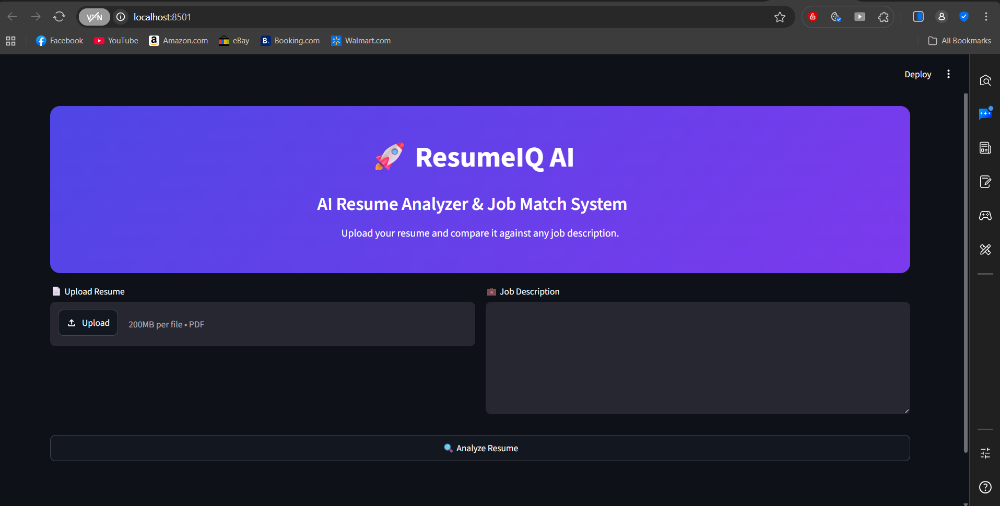
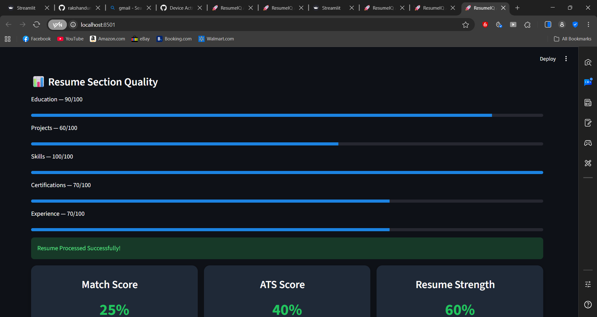
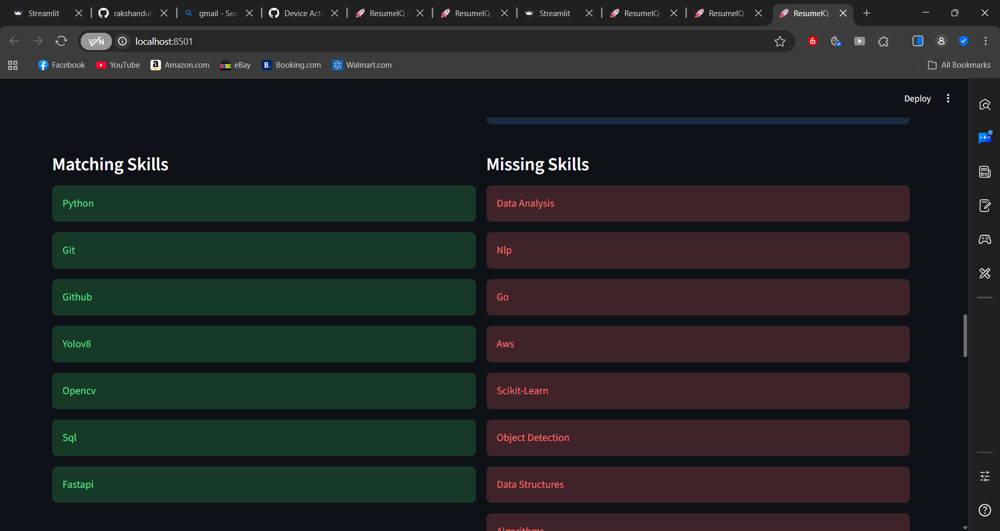
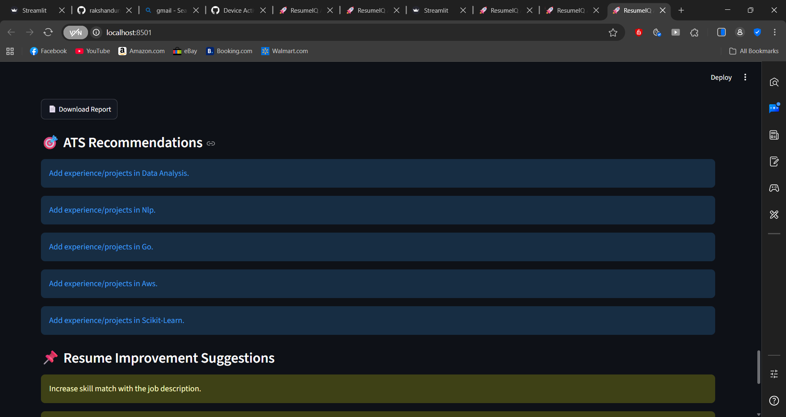
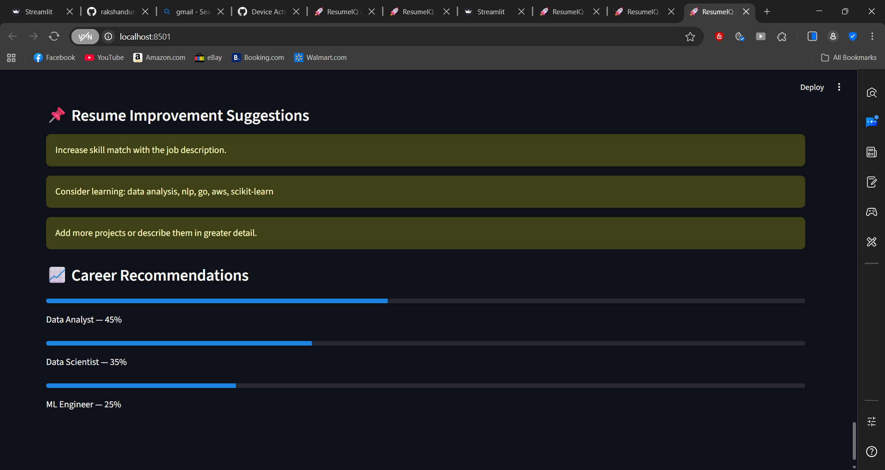

# 🚀 ResumeIQ AI

ResumeIQ AI is an AI-powered Resume Analyzer that compares a candidate's resume against a job description and provides ATS-style insights, skill matching, section analysis, and resume improvement recommendations.

---

## 🌐 Live Demo

🚀 [Launch ResumeIQ AI](https://resumeiq-ai-is6tibmfmzb3gquekce2gl.streamlit.app/)

## 📌 Features

## 📸 Application Screenshots

### 🏠 Home Page


### 📊 Resume Analysis Dashboard


### 🎯 ATS Recommendations


### 📌 Resume Improvement Suggestions


### 🚀 Career Recommendations & Final Results


### 📄 Resume Parsing

* Upload Resume PDF
* Extract resume text automatically
* Analyze resume content

### 🎯 ATS Analysis

* Match Score Calculation
* ATS Score Generation
* Resume Strength Assessment

### 🧠 Skills Analysis

* Resume Skills Extraction
* Job Description Skills Extraction
* Matching Skills Detection
* Missing Skills Identification

### 📊 Visual Analytics

* Skill Match Pie Chart
* Resume Quality Metrics
* Interactive Dashboard

### 📋 Resume Section Analysis

* Education Score
* Projects Score
* Skills Score
* Certifications Score
* Experience Score

### 📌 Resume Improvement Suggestions

* Missing Skill Recommendations
* Project Improvement Suggestions
* Experience Enhancement Suggestions
* ATS Optimization Tips

### 📄 Report Generation

* Download Analysis Report
* Resume Summary Export

### 🚀 ATS Engine V2

* Multi-Factor ATS Scoring
* ATS Score Breakdown
* Skills, Projects, Experience, Education & Certification Scoring

### 🏅 Resume Ranking

* Beginner
* Developing Candidate
* Strong Candidate
* Interview Ready

### 🧑‍💼 Recruiter Summary

* AI-Generated Recruiter Insights
* Candidate Strength Analysis
* Job Readiness Evaluation

### 🎓 Certification Intelligence

* Certification Detection
* Certification Categorization
* Career Role Mapping

### 🚀 Project Intelligence

* Project Detection
* Project Complexity Analysis
* Impact Score Evaluation

### 💼 Experience Intelligence

* Internship Detection
* Experience Classification
* Industry Relevance Analysis

### 🎓 Education Intelligence

* Degree Detection
* Domain Alignment Analysis
* Career Role Recommendations

---

## 🛠️ Tech Stack

### Frontend

* Streamlit

### Backend

* Python

### Libraries

* Pandas
* Plotly
* PyPDF2

### Version Control

* Git
* GitHub

---

## 📂 Project Structure

```text
ResumeIQ-AI/
│
├── app.py
│
├── utils/
│   ├── pdf_parser.py
│   ├── skill_extractor.py
│   ├── section_analyzer.py
│   ├── role_predictor.py
│   └── resume_suggestions.py
│
├── utils_v2/
│   ├── ats_engine_v2.py
│   ├── certification_extractor.py
│   ├── education_extractor.py
│   ├── education_analyzer.py
│   ├── experience_extractor.py
│   ├── experience_analyzer.py
│   ├── recruiter_summary.py
│   └── resume_ranker.py
│
├── requirements.txt
├── README.md
└── .gitignore
```

---

## ⚙️ Installation

### Clone Repository

```bash
git clone https://github.com/rakshandummari51-code/ResumeIQ-AI.git
cd ResumeIQ-AI
```

### Create Virtual Environment

```bash
python -m venv venv
```

### Activate Environment

#### Windows

```bash
venv\Scripts\activate
```

### Install Dependencies

```bash
pip install -r requirements.txt
```

---

## ▶️ Run Application

```bash
python -m streamlit run app.py
```

---

## 📈 Current Development Progress

### Phase 1 ✅

* Resume Upload
* Resume Parsing
* Skill Matching
* ATS Score
* Match Score
* Resume Strength

### Phase 2 ✅

* Resume Section Analyzer

### Phase 2.1 ✅

* Resume Section Quality Scoring

### Phase 2.2 ✅

* Resume Improvement Suggestions

### Upcoming Features 🚀

### Phase 3 (Planned) 🌍

* Domain Detection Engine
* Universal Career Intelligence Platform
* Dynamic Career Roadmaps
* Industry-Specific ATS Scoring
* Support for Engineering, Medicine, Business, Law, Commerce and More
---

## 👨‍💻 Author

**Rakshan Dummari**

* GitHub: https://github.com/rakshandummari51-code
* Email: [rakshan.dummari51@gmail.com](mailto:rakshan.dummari51@gmail.com)

---

## ⭐ Support

If you found this project useful, consider giving it a star on GitHub.
